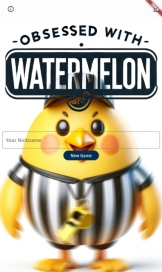

# Flutter Web App "Obsessed with Watermelon"
## Overview
"Obsessed with Watermelon" is a two-player online Tic-Tac-Toe variant with a unique referee system. You can play with your friend through the network only by sharing the generated URL. Initially envisioned as a monetized mini-game platform, and also as my first programming project.

 
  
  

## Features
- **Unique Referee System**: You can bribe or accuse a corrupt referee without risking your life. ...But why would you have to play this game in the first place, when you know it's rigged by him from the beginning...?
- **Chat Feature**: Players can communicate with each other during matches via the in-game chat.
- **JWT Authentication**: Authentication using JSON Web Tokens (JWT), allowing for easy online play.

## Available on my website

 
<a href="https://abehiroto.com/wmapp">Obsessed with Watermelon</a>